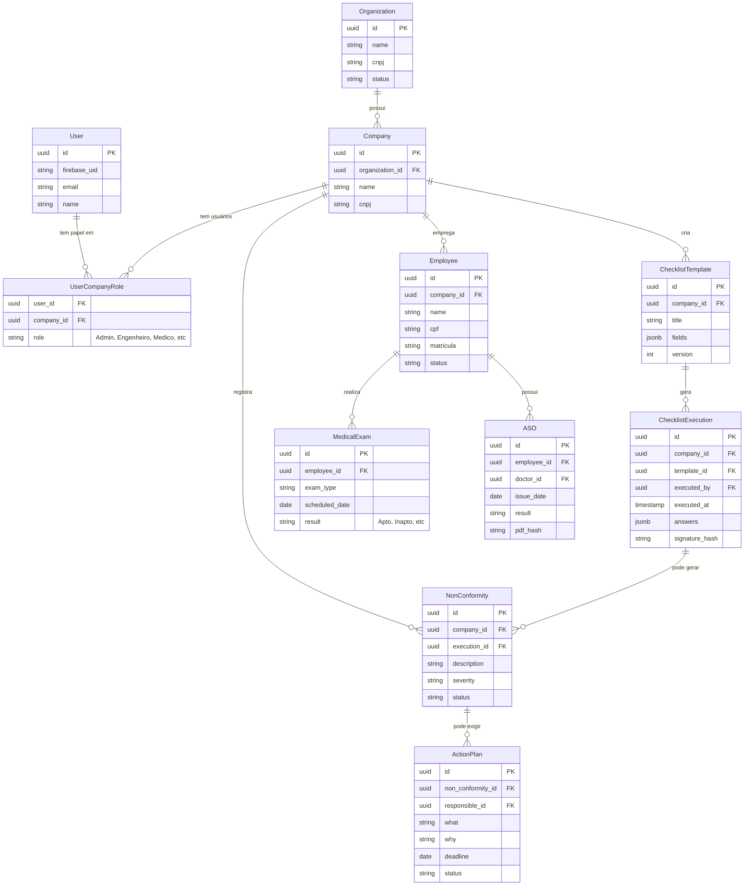

# Estrutura do Banco de Dados (ERD Inicial)
**Fase 4 - Mapa de Banco de Dados**

Este diagrama apresenta o núcleo relacional do SGSST. Ele reflete o isolamento por `tenant_id` (Organização) e a segregação lógica de informações sensíveis (Saúde) vs Operacionais.

## Considerações de Banco
- **Row-Level Security (RLS):** Todas as tabelas que possuem `company_id` ou `organization_id` (com exceção das tabelas de configuração global) terão políticas de RLS.
- **Tenant Context:** O backend passará o contexto do Tenant ativo antes das transações.
- **Trilha de Auditoria:** Uma tabela `audit_log` (Schema Append-Only) guardará `table_name`, `record_id`, `action`, `old_data` (JSONB), `new_data` (JSONB), `user_id`, garantindo rastreabilidade histórica completa.
